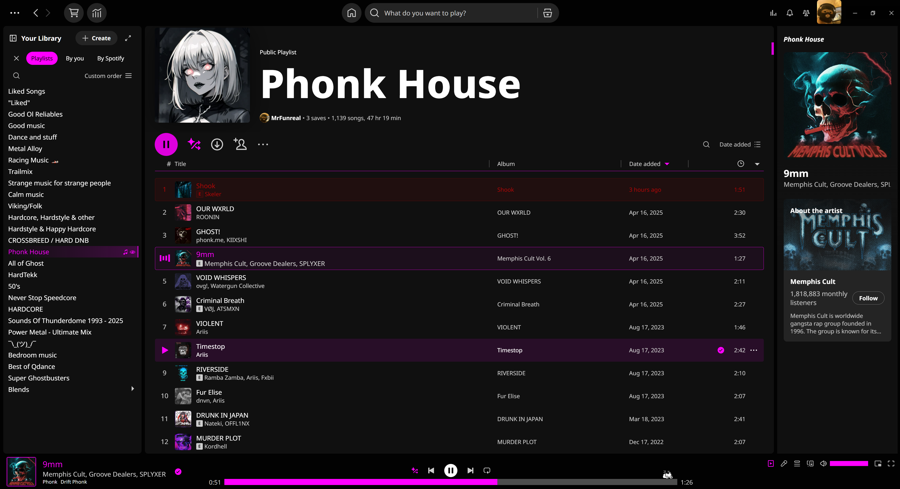
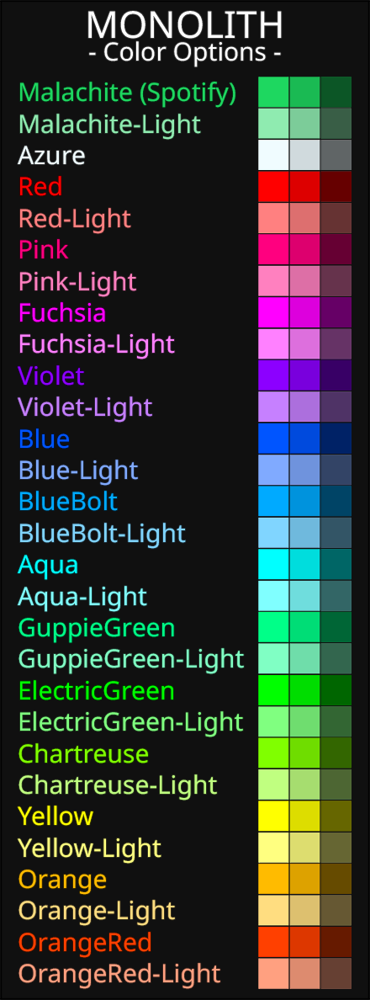
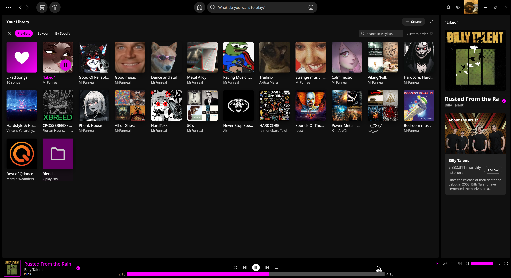
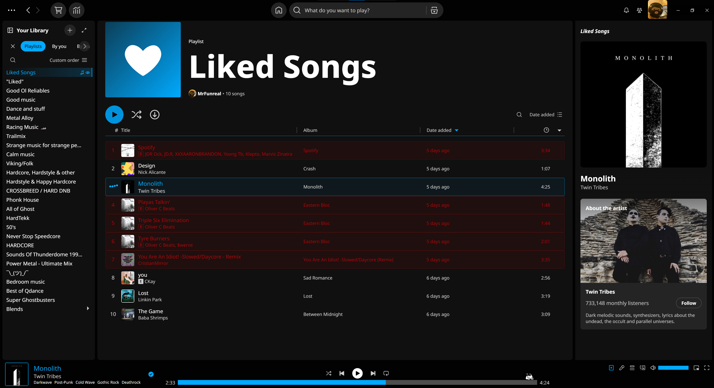
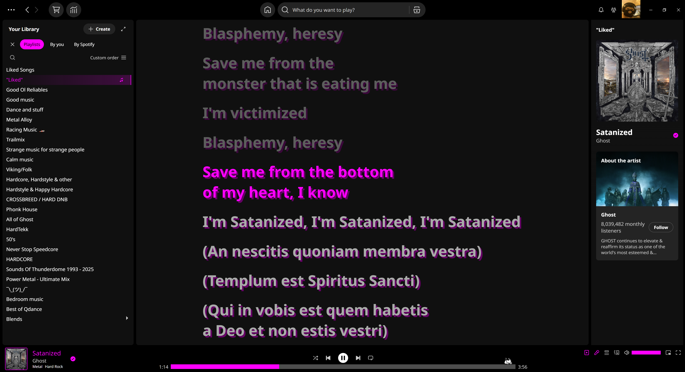
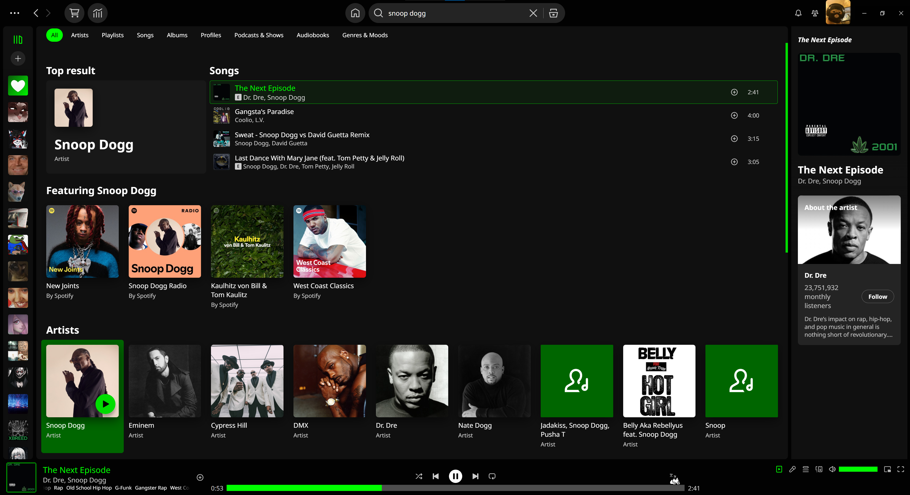

<p align="center"></p>

# Monolith

A sleek and simple theme for Spicetify.<br> 
Most everything is dark, with some colorful highlights, the color of which you can modify.
<div class="grid" markdown>
 
</div>

# Preview images
<details><summary>Expand me ♫</summary>









</details>

## Notable features
- General:
	- Font changed to "Noto Sans" for nicer readability.
	- Your own avatar on top right is larger.
	- Profile images on user pages are now square.
	- Thinner scrollbars.
	- Liked songs playlist has new image, fitting scheme (gradient with heart icon).
	- Lyrics screen fitting theme.
	- Like and Unlike checkmark anims swapped for basic wait circle. (Couldn't be recolored, Hardcoded to be green, Looked odd.)
	- Removed "background noise" image on band header pages. (It was some generic shadow gradient)
- Home screen:
	- Removed "Shortcuts" on top of home screen.
	- Removed "Jump Back in".
	- Removed laggy video section on bottom.
	- Removed "Popular" reccomendations.
- Track list
	- Header section compacted down, no background color.
	- Removed "Preview/Summary" button.
	- Currently playing song is highlighted in accent color.
	- Unavailable songs are highlighted dark red.
	- Playing song has new equalizer. Waiting anim when paused. Both SVG anims.
	- Always shows "Add to playlist" icon on playlists you do not own.
- Library
	- Note icon `♫` displayed on currently playing library item.
	- Eye icon `👁` displayed on currently looked at library item.
	- Artist images are now square.
	- Text sidebar more compact. (from 32px to 26px height )
	- Collapse/Expand library button is always shown, and doesn't slide around anymore. Too distracting
- Bottom Media Bar
	- Song info on bottom left has border around cover art and stylized coloring.
	- Progress bar wider and way thicker for easier skipping through songs.
	- Removed useless little dot under active options (Crossplay, Lyrics, Ect) The buttons are colored, why the dots?.
	- Elapsed/Remaining time numbers larger
- Search Result Page
	- Removed Profiles, Audiobooks, Episodes and Podcasts. The top header still has filters to view just those.<br>
Main results are only "Featuring x", Artists, Albums, Playlists, and "Genres & Moods" is available.
- Now Playing Sidebar
	- Only shows song data and artist data. No more queue, merch, tour, credits, or redundand buttons.

#### Notes
- Modified "Loopy loop" queue points to fit new progress bar.
- Progress bar lowered specifically so Oneko can show up without being covered.

## Known Issues
- "Add to library" wait circle _might_ attach to elements added by extensions, and scale is a little off for "like playlists".
- Some progress bar additions, like the Kirby gif, seem to move up and down.

## Installation
It's recommended to find and install this theme on the [Spicetify Marketplace](https://github.com/CharlieS1103/spicetify-marketplace).<br> 
Which will also allow you to set scheme color in the app, without requiring a Spicetify reboot.


**Linux and MacOS** in Bash:
```bash
cd "$(dirname "$(spicetify -c)")/Themes"
git clone https://github.com/Mrfunreal/Monolith
```

**Windows** in Powershell:
```powershell
cd "$(spicetify -c | Split-Path)\Themes"
git clone https://github.com/Mrfunreal/Monolith
```

**Changing schemes manually**
```Powershell
spicetify config current_theme Monolith
spicetify config color_scheme XXXXXX
spicetify apply
```
Replace XXXXXX with whichever color combination you would like. Eg. `spicetify config color_scheme Red-Orange`


