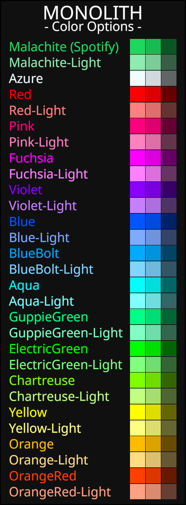

# Monolith

A sleek and simple theme for Spicetify.<br> 
Most everything is dark, with some colorful highlights, the color of shich you can modify.
<div class="grid" markdown>
 
</div>

# Preview images
<details><summary>Expand me ♫</summary>


</details>

## Notable features
- General:
	- Font changed to "Noto Sans" for nicer readability.
	- Thinner scrollbars.
	- Liked songs playlist has new fitting scheme.
	- Lyrics screen fitting theme.
	- Like and Unlike checkmark anims swapped for basic wait circle. (Couldn't be recolored, Hardcoded to be green, Looked odd.)
- Home screen:
	- Removes "Shortcuts" on top that keep rearranging.
	- Removes "Jump Back in".
	- Removes video section on bottom. Its just more reccomendations anyways and is laggy.
	- Removes "Popular" reccomendations.
- Track list
	- Header section compacted down, no background color.
	- Removes "Preview/Summary" button.
	- Currently playing is easily visible.
	- Unavailable songs are highlighted dark red.
	- Playing song has new equalizer. Waiting anim when paused. Both SVG anims.
	- Always shows "Add to playlist" icon on playlists you do not own.
- Library
	- new icons for "looked at" and "now playing" playlists.
- Player section
	- Track info on bottom left has border aroudn cover art and stylized coloring.
	- Wider and thicker progress bar.
-Other
	- "Now Playing" sidabard only shows song data and artist data. No more queue, merch, tour, credits.

## Known bugs
- "Add to library" wait circle _might_ attach to elements added by extensions. 


## Installation
It's recommended to find and install this theme on the [Spicetify Marketplace](https://github.com/CharlieS1103/spicetify-marketplace).<br> 
Which will also allow you to set scheme color in the app, without requiring a Spicetify reboot.


**Linux and MacOS** in Bash:
```bash
cd "$(dirname "$(spicetify -c)")/Themes"
git clone https://github.com/Mrfunreal/Monolith
```

**Windows** in Powershell:
```powershell
cd "$(spicetify -c | Split-Path)\Themes"
git clone https://github.com/Mrfunreal/Monolith
```

**Changing schemes manually**
```Powershell
spicetify config current_theme Monolith
spicetify config color_scheme XXXXXX
spicetify apply
```
Replace XXXXXX with whichever color combination you would like. Eg. `spicetify config color_scheme Red-Orange`


