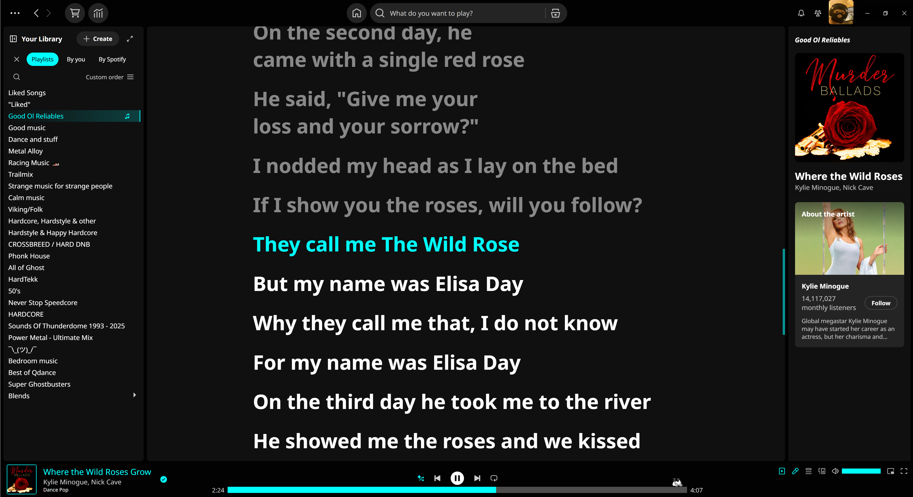
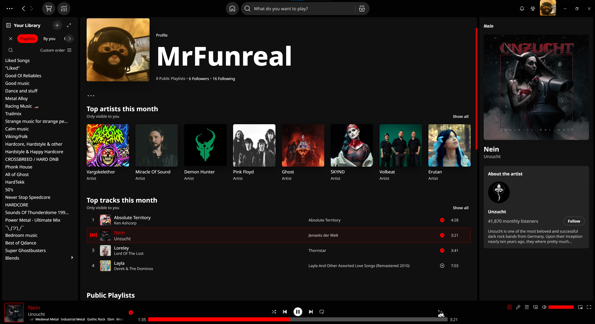

<p align="center"></p>

<hr>

<p align="center">Dark theme with 15 accent colors to choose from.
<br> Author: <a href="https://github.com/Mrfunreal">MrFunreal</a> <a href="https://github.com/Mrfunreal/Monolith">Repo</a></p>

<details><summary>Screenshots</summary>





</details>

# Notable features


### General:
- Font changed to "Noto Sans" for nicer readability.
- Your own avatar on top right is larger.
- Profile images on user pages are now square.
- Thinner scrollbars.
- Liked songs playlist has new image, fitting scheme.
- Lyrics screen fitting theme.
- Like and Unlike checkmark anims swapped for basic wait circle, due to limitations.
- Removed "background noise" image on band header pages.

### Home screen:
- Removed "Shortcuts" on top of home screen.
- Removed "Jump Back in".
- Removed laggy video section on bottom.
- Removed "Popular" reccomendations.

### Track list
- Header section compacted down, no background color.
- Removed "Preview/Summary" button.
- Currently playing song is highlighted in accent color.
- Unavailable songs are highlighted dark red.
- Playing song has new equalizer. Waiting anim when paused. Both SVG anims.
- Always shows "Add to playlist" icon on playlists you do not own.

### Library
- Note icon `♫` displayed on currently playing library item.
- Eye icon `👁` displayed on currently looked at library item.
- Artist images are now square.
- Text sidebar more compact. (from 32px to 26px height )
- Collapse/Expand library button is always shown, and doesn't slide around anymore.

### Bottom Media Bar
- Song info on bottom left has border around cover art and stylized coloring.
- Progress bar wider and way thicker for easier skipping through songs.
- Removed useless little dot under active options. (Crossplay, Lyrics, Ect)
- Elapsed/Remaining time numbers larger

### Search Result Page
- Removed Profiles, Audiobooks, Episodes and Podcasts. USe the headers filters, if you need to.<br>Main results are only "Featuring x", Artists, Albums, Playlists, and "Genres & Moods" is available.

### Now Playing Sidebar
- Only shows song data and artist data. No more queue, merch, tour, credits, or redundand buttons.

# Notes
- Modified "Loopy loop" queue points to fit new progress bar.
- Progress bar lowered specifically so Oneko can show up without being covered. It's not actually part of my theme, but a cat needs a bed.
- "Add to library" wait circle _might_ attach to elements added by extensions, and scale is a little off for "like playlists".
- Some progress bar additions, like the Kirby gif, seem to move up and down.

# Installation
It's recommended to find and install this theme on the [Spicetify Marketplace](https://github.com/spicetify/marketplace).<br> 
Which will also allow you to set scheme color in the app, without requiring a Spicetify reboot.


**Linux and MacOS** in Bash:
```bash
cd "$(dirname "$(spicetify -c)")/Themes"
git clone https://github.com/Mrfunreal/Monolith
```

**Windows** in Powershell:
```powershell
cd "$(spicetify -c | Split-Path)\Themes"
git clone https://github.com/Mrfunreal/Monolith
```

**Changing schemes manually**
This only applies if you're not using the marketplace to install the theme.
```Powershell
spicetify config current_theme Monolith
spicetify config color_scheme XXXXXX
spicetify apply
```
Replace XXXXXX with whichever color combination you would like. Eg. `spicetify config color_scheme Red-Orange`

<details><summary>Color Names to Copy-Paste</summary>
<br>malachite
<br>malachite-light
<br>azure
<br>red
<br>red-light
<br>pink
<br>pink-light
<br>fuchsia
<br>fuchsia-light
<br>violet
<br>violet-light
<br>blue
<br>blue-light
<br>bluebolt
<br>bluebolt-light
<br>aqua
<br>aqua-light
<br>guppiegreen
<br>guppiegreen-light
<br>electricgreen
<br>electricgreen-light
<br>chartreuse
<br>chartreuse-light
<br>yellow
<br>yellow-light
<br>orange
<br>orange-light
<br>orangered
<br>orangered-light
</details>
